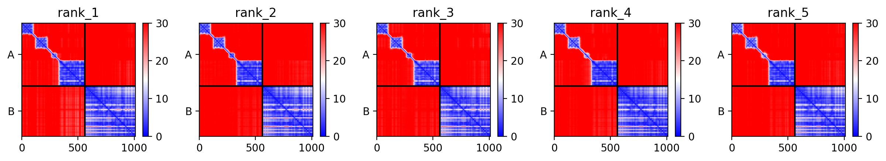
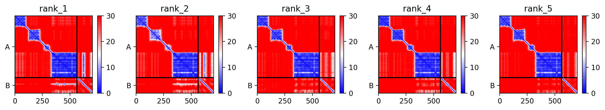
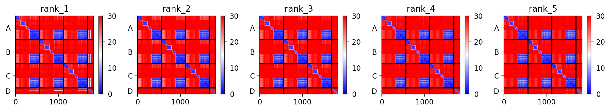
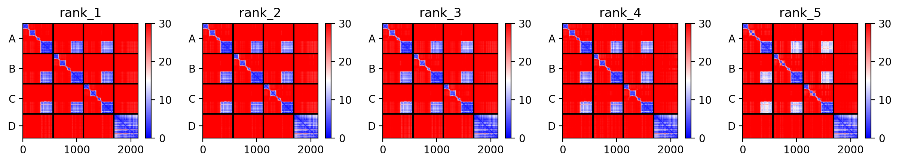

# Computational Investigation of DLAT–MED1 Interaction Using AlphaFold-Multimer

A self-initiated computational structural biology project investigating the molecular basis of the pyruvate dehydrogenase complex E2 subunit (DLAT) interaction with Mediator complex subunit MED1, extending the experimental findings of Russo et al. (2024).

---

## Biological motivation

Russo et al. (2024, *Molecular Cell*) demonstrated by co-immunoprecipitation from RAW264.7 macrophage lysates that DLAT, the E2 acetyltransferase subunit of the pyruvate dehydrogenase complex (PDH), associates with the Mediator complex in vivo during macrophage activation. This finding establishes that the PDC and Mediator physically associate in a physiologically relevant context, providing a potential structural basis for the local delivery of acetyl-CoA to Mediator-bound chromatin regulatory regions. However, the molecular basis of this interaction, which subunit surfaces mediate the contact and through which region of MED1, remains unknown.

**This project uses AlphaFold-Multimer to computationally investigate the predicted structural basis of this interaction**, testing two hypotheses:
1. Does DLAT interact with MED1 through its structured domain region (MED1 domain, residues 72–520)?
2. Does DLAT interact with MED1 through its LXXLL coactivator recruitment region (residues 590–730)?

---

## Key findings

| Run | DLAT form | MED1 fragment | ipTM | Interface character |
|-----|-----------|---------------|------|---------------------|
| 1 | Monomer | MED1 domain (72–520) | 0.148 | Mixed / polar |
| 2 | Monomer | LXXLL (590–730) | 0.344 | Hydrophobic |
| 3 | **Trimer** | **LXXLL (590–730)** | **0.505** | **Hydrophobic** |
| 4 | Trimer | MED1 domain (72–520) | 0.412 | Polar / H-bond |

**Four consistent findings across all runs:**

1. **The acetyltransferase catalytic domain (mature residues 334–561) is the sole predicted MED1 contact surface** — contributing 74–100% of DLAT interface residues in every run
2. **The Peripheral Subunit-Binding Domain (PSBD) (mature residues 270–307) is completely free in all predictions** — zero contacts in every model, suggesting compatibility with intact PDC assembly during Mediator engagement
3. **Trimer modeling dramatically improves interaction confidence** — ipTM increases from 0.148→0.412 (MED1 domain) and 0.344→0.505 (LXXLL), demonstrating that quaternary assembly creates emergent interaction surfaces absent in the isolated monomer
4. **The MED1 LXXLL coactivator recruitment region is the preferred contact** — with both LXXLL motifs engaged simultaneously by two adjacent DLAT subunits in the trimer run, consistent with canonical coactivator LXXLL motif engagement

---

## Repository structure

```
DLAT-MED1-AlphaFold-Multimer/
│
├── README.md                            # This file
│
├── scripts/
│   └── dlat_med1_interface_analysis.py  # Python interface analysis script
│
├── pdb/
│   ├── run1_dlat_monomer_med1_ted_rank001.pdb
│   ├── run2_dlat_monomer_med1_lxxll_rank001.pdb
│   ├── run3_dlat_trimer_med1_lxxll_rank001.pdb
│   └── run4_dlat_trimer_med1_ted_rank001.pdb
│
├── figures/
│   ├── run1_pae.png                     # PAE plot — DLAT monomer + MED1 domain
│   ├── run2_pae.png                     # PAE plot — DLAT monomer + MED1 LXXLL
│   ├── run3_pae.png                     # PAE plot — DLAT trimer + MED1 LXXLL
│   ├── run4_pae.png                     # PAE plot — DLAT trimer + MED1 domain
│
├── sequences/
│   └── input_sequences.txt              # FASTA sequences used for ColabFold input

```
---

## Methods

### Proteins studied

**DLAT** (Dihydrolipoamide acetyltransferase, E2 subunit of PDH)
- UniProt: [P10515](https://www.uniprot.org/uniprotkb/P10515)
- Mature sequence used: residues 87–647 (561 amino acids, mitochondrial targeting sequence excluded)
- Domain architecture: Lipoyl domain 1 (1–90) · Linker (91–131) · Lipoyl domain 2 (132–208) · Inter-domain linker (209–269) · PSBD (270–307) · PSBD-AT linker (308–333) · Acetyltransferase domain (334–561)
- Modeled as **monomer** (Runs 1–2) and **homotrimer** (Runs 3–4)

**MED1** (Mediator subunit 1)
- UniProt: [Q15648](https://www.uniprot.org/uniprotkb/Q15648)
- Full length (1582 aa) not modeled due to GPU memory constraints
- **MED1 domain fragment**: residues 72–520 (449 aa) — covers InterPro structured domains (60–427) and extended structured region (428–520)
- **LXXLL fragment**: residues 590–730 (141 aa) — covers LXXLL motif 1 (604–608, LTSLL), LXXLL motif 2 (645–649, LMNLL), and experimentally confirmed interaction regions for PPARGC1A/THRA (622–701) and GATA1 (681–715)

### AlphaFold-Multimer modeling

- **Tool**: AlphaFold-Multimer v3 via [ColabFold](https://github.com/sokrypton/ColabFold)
- **Notebook**: `AlphaFold2.ipynb` (sokrypton/ColabFold)
- **Settings**: MSA mode `mmseqs2_uniref_env` · pair mode `unpaired_paired` · 5 models per run · 3 recycling iterations · no templates · no relaxation
- **Hardware**: Google Colab free tier (NVIDIA T4, 15GB) for monomer runs · Google Colab Pro (NVIDIA A100-SXM4-40GB, 40GB) for trimer runs
- **Ranking**: Models ranked by combined ipTM + pTM score; rank 1 used for structural analysis

### Interface analysis

All analysis performed from the unrelaxed rank 1 PDB files using the custom Python script in `scripts/`.

- **Contact cutoff**: 5.0 Å
- **H-bonds**: N/O donor–acceptor pairs between 2.5–3.5 Å
- **Salt bridges**: Oppositely charged residue pairs (Arg/Lys/His vs Asp/Glu) with charged atoms within 4.0 Å
- **Hydrophobic contacts**: Nonpolar residue pairs (Ala/Val/Ile/Leu/Met/Phe/Trp/Pro/Tyr) within 5.0 Å

### Sequence numbering

- DLAT residue numbers are in **mature sequence numbering** (residue 1 = UniProt P10515 residue 87)
- MED1 domain fragment: PDB residue + 71 = UniProt Q15648 full sequence number
- MED1 LXXLL fragment: PDB residue + 589 = UniProt Q15648 full sequence number

---

## Running the interface analysis script

No dependencies beyond Python 3 standard library.

**Single file mode:**
```bash
# Run 1 — DLAT monomer + MED1 domain
python scripts/dlat_med1_interface_analysis.py pdb/run1_dlat_monomer_med1_ted_rank001.pdb A B 71 "Run 1"

# Run 2 — DLAT monomer + MED1 LXXLL
python scripts/dlat_med1_interface_analysis.py pdb/run2_dlat_monomer_med1_lxxll_rank001.pdb A B 589 "Run 2"

# Run 3 — DLAT trimer + MED1 LXXLL
python scripts/dlat_med1_interface_analysis.py pdb/run3_dlat_trimer_med1_lxxll_rank001.pdb A,B,C D 589 "Run 3"

# Run 4 — DLAT trimer + MED1 domain
python scripts/dlat_med1_interface_analysis.py pdb/run4_dlat_trimer_med1_ted_rank001.pdb A,B,C D 71 "Run 4"
```

**Batch mode (all four runs):**
```bash
# Edit the pdb_files dictionary in the script with your local paths, then:
python scripts/dlat_med1_interface_analysis.py
```

---

## PAE plots

PAE (Predicted Aligned Error) plots from all four runs. The inter-chain quadrants (off-diagonal blocks) indicate confidence in relative chain positioning — green = confident, red = uncertain.

| Run 1 — DLAT monomer + MED1 domain | Run 2 — DLAT monomer + MED1 LXXLL |
|---|---|
|  |  |

| Run 3 — DLAT trimer + MED1 LXXLL | Run 4 — DLAT trimer + MED1 domain |
|---|---|
|  |  |

---

## Limitations

- The co-immunoprecipitation data of Russo et al. (2024) reflects whole-complex association in native macrophage lysate, direct binary interaction between isolated DLAT subunits and MED1 fragments has not been experimentally confirmed
- AlphaFold-Multimer detects interactions primarily through co-evolutionary signal, moonlighting metabolic–transcriptional interactions may be underrepresented in co-evolutionary databases
- Full-length MED1 (1582 aa) could not be modeled due to GPU memory constraints (~80–100 GB required for DLAT trimer + full MED1)
- The full PDC 60-mer context, which determines which acetyltransferase surfaces are exposed vs buried, was computationally infeasible; trimer modeling partially addresses this limitation
- All predictions require experimental validation

---

## Reference

Russo M, et al. (2024). Acetyl-CoA production by Mediator-bound 2-ketoacid dehydrogenases boosts de novo histone acetylation and is regulated by nitric oxide. *Molecular Cell*. doi: [10.1016/j.molcel.2023.12.033](https://doi.org/10.1016/j.molcel.2023.12.033)

Mirdita M, et al. (2022). ColabFold: Making protein folding accessible to all. *Nature Methods*, 19, 679–682.

Evans R, et al. (2022). Protein complex prediction with AlphaFold-Multimer. *bioRxiv*. doi: 10.1101/2021.10.04.463034

---

## Tools used

| Tool | Purpose |
|------|---------|
| [AlphaFold-Multimer v3](https://github.com/google-deepmind/alphafold) | Protein complex structure prediction |
| [ColabFold](https://github.com/sokrypton/ColabFold) | AlphaFold-Multimer via Google Colab |
| [Google Colab Pro](https://colab.research.google.com) | GPU computing (A100 40GB) |
| [UniProt](https://www.uniprot.org) | Protein sequence and domain annotation |
| [InterPro](https://www.ebi.ac.uk/interpro) | Domain architecture visualization |
| [AlphaFold Database](https://alphafold.ebi.ac.uk) | Solo structure visualization |
| [Mol*](https://molstar.org/viewer/) | 3D structure visualization |
| Python 3 (standard library) | PDB parsing and interface analysis |
